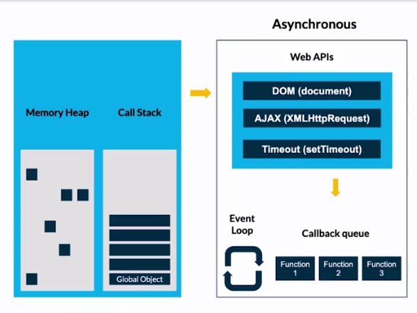

# V8 -> El gran engine de JavaScript

## Contexto de JavaScript

JavaScript es un lenguaje que nace gracias a Netscape, más específicamente por Brendan Eich en 1995, pero antes de eso generó un lenguaje para Netscape que llamó Mocha y su desarrolló duro casi 2 semanas, debido a ello tenía mucho por mejorar, por lo cuál el mismo año de 1995 sale LiveScript, pero justo a finales de ese mismo año nace JavaScript, se hace llamar así por un tema de Marketing ya que en esos años Java era lo que amaba la gente, espero no confundas que Java y JavaScript son lo mismo.

Después de eso Microsoft que ya tenía su navegador Internet Explorer (que en paz descanse), decide tomar JavaScript y hacerle cambios, por lo cual genera JScript, que original nombre Microsoft.

Te imaginas ser desarrollador web en esa época, tenías que adaptar tus productos a los distintos navegadores porque no existían estándares, afortunadamente unas buenas personas se dieron cuenta de esto, esas grandiosas personas son parte de ECMA que en 1997 tomaron la grandiosa decisión de borrar todas las versiones de JavaScript y crear el único estándar para los navegadores, ellos estarían a cargo de dar las nuevas versiones, gracias ECMA, eres nuestro Salvador.

Pasó un largo tiempo para que otro gran suceso pasará en la historia de JavaScript, porque hasta 2008 llega V8 de la mano de Google para su navegador Chrome.

Al año siguiente se crea Node.js que es la forma que sacamos superpoder a JavaScript para llevarlo al lado del servidor o Backend, está construido sobre V8.

Para 2016 sucedió un importante feature o cambio en JavaScript porque llegó ECMA Script 6, que trajo grandes cambios al lenguaje que a gran parte de la comunidad le gustó, a partir de ese año ECMA decidió lanzar una nueva versión cada año.

# Engine JS

Cuando das indicaciones al navegador por el lenguaje JavaScript, al llegar al navegador la máquina no lo va entender porque sólo entiende el Machine Code, por ello es necesario contar con una herramienta que traduzca mi código JavaScript a el Machine Code, ahí es donde aparece nuestro amigo el engine o motor de JavaScript, este se encuentra en el navegador, así que cuando llegué tu código de JavaScript, se va a dar al engine que lo va a traducir a Machine Code para que lo entienda mi computadora y saldrá mi resultado, este proceso es importante, a la etapa de traducción por el engine se le conoce como Just In Time Compiler (JIT), sucede en tiempo real,

## V8

Como ya se mencionó antes V8 es un engine desarrollado por Google para Chrome, cabe mencionar que no es el único engine que existe, hay una gran variedad pero V8 toma gran importancia debido a su velocidad y porque existen otros navegadores que también lo están adoptando debido a que es Open Source.

Nace porque Google se encontraba desarrollando Maps, era complejo su desarrollo porque por detrás corría demasiadas cosas, lo que causaba que en otros navegadores se alentará su carga.

La razón del nombre “motor V8” y el logo se debe a la identificación con los motores V8 de los automóviles. Un motor V8 en el automovilismo es un motor montado en el cárter con dos bancos de cuatro cilindros, que comparten cigüeñal, formando una “V”.

## Proceso

Antes de empezar a traducir nuestro código, lo que hace V8 es crear un Global Enviroment o entorno global, esto es un objeto principal al que se llama Window,  al crear ese objeto principal hace 3 cosas, 2 de ellas son muy importantes, la primera es dar un objeto global, ese objeto es igual a window, después genera una variable que es this, que depende mucho del contexto en que sea llamado, entonces al ser creada en el entrono global this es igual a window, después de eso pasa al contexto de ejecución que es donde ya empieza a correr nuestro código por medio de un Stack o pila de tareas, más delante encontrarás la explicación de esto.

Cuando ya interactúa el motor con el navegador se genera un parseo esto significa analizar y convertir un programa en un formato interno que un entorno de ejecución pueda realmente ejecutar, esta parte le ayuda para encontrar las keywords que son importantes para JavaScript porque con ellas hace un AST (Abstract Syntax Tree), puedes pasar al <a href="https://astexplorer.net/">siguiente link</a> para comprender de esto.

Al tener ese árbol listo, lo lleva a interpretar para seguidamente dar el byte code, que es lo que entiende la computadora, pero existe un paso en que al analizar el árbol, el intérprete se da cuenta que hay mucho código que puede optimizar, ahí entra el profiler, que también se le conoce como monitor, este paso ayuda a optimizar nuestro código que pasa a un compilador para devolver el byte code, resulta de gran importancia este paso porque aquí sucede el Hoisting👿.

## Hoisting

Puedes odiarlo o amarlo, si lo amas aléjate de mí, el Hoisting es la parte de ayuda de nuestro engine, veamos el siguiente código:

```javascript
console.log(name);
var name = 'Daniel'
```

Si ejecutas este código probablemente no lo entiendas, su resultado será undefined, pero además esto no tiene mucha lógica: porque llamarías una variable antes de poder crearla, acaso estas loco.

El engine de JavaScript hace lo siguiente: Bueno mi querido programador quiere imprimir esta variable name, pero no la tengo, le voy a ayudar un poco:

```javascript
var name = undefined;
console.log(name);
name = 'Daniel';
```

El engine manda a crear un espacio con el valor undefined que lo lleva a un lugar llamado Memory Heap.

Para el caso de las funciones declaras es un poco distinto, ya que si llamas una función antes de declararla, si funcionará:

```javascript
lastName();
function lastName(){
	console.log('Armas');
}
```

El Hoisting aquí cambia porque el engine hace lo siguiente: Bueno se que lastName es una función pero no se que hace, la voy a enviar a Memory Heap sigo analizando y después  cuando vea que hace la ejecuto.

Ahora puedes ver como funciona el Hoisting, pero no lo uses porque es mala práctica y para aplicaciones más grandes tendrás muchos problemas. Todo esto sucede en el proceso del Profiler o Monitor que vimos antes.

## Memory Heap

Puede que lo hayas escuchado antes, este término hace referencia a donde se van a almacenar nuestros datos, imagínalo como una repisa del almacén, aquí van nuestras funciones, var, let o const, algo curioso es que al almacenar esos datos no se hacen de forma lineal, sino que el engine lo pone a su gusto, algo como: A pues aquí hay espacio pues aquí lo pongo, lo pone en diversas partes y por ello nosotros no podemos saber su ubicación. Es como si en tu habitación parece un desorden para tu mamá pero si te pide poner un suéter tu sabes donde están, JavaScript sabe donde está el dato y es por ello que podemos acceder a él.

## Call Stack

Ya tenemos nuestros datos almacenados en el Memory Heap, perfecto ahora hace falta una herramienta que me permita decirle al navegador como se va a comportar mi código, ahí entra el call stack, mi pila de tareas donde se van a almacenar de abajo hacia arriba donde la única tarea que se puede sacar es la última. Imagina que en tu cocina están los platos más caros de tu mamá, si rompes uno probablemente te saque de casa, están apilados entonces si quieres utilizar un plato no vas a tomar uno de en medio o el de abajo porque probablemente se rompan todos los platos, el único que puedes tomar es el último, o el que está arriba de todos.

La primer cosa en el call stack será nuestro objeto global, de ahí se irán apilando nuestras tareas sobre él, si una tarea requiere de otra, la va a encimar sobre él, a esto se le llama sincronía, sólo trabaja una tarea a la vez.

Puedes ver algo un poco más visual en la siguiente página: <a href='http://latentflip.com/loupe/'>Loupe</a>

También en tu navegador puedes ver el call stack cuando vas a las DevTools en Source y Snippets.

## Garbage Collection🗑

JavaScript tiene su Garbage Collection, o recolector de basura, nos ayuda bastante y trabaja con un Proceso llamado Mark and Sweep, lo que hace es ver el stack y nota que ya no estamos ocupando ciertas funciones o variables, hace un Mark y después el Sweep, veamos algo con código:

```javascript
var car = {
	name = 'Model 3',
	year = 2020,
}
```

He creado una variable, y al ser variable le puedo cambiar el valor:

```javascript
car = 'Model 3';
```

El Garbage collection se encarga de limpiar la memoria de los datos no utilizados para no sobrecargar la memoria y trabajar sin problemas. Si eres un joven con un armario pequeño y notas que almacenas ropa de niño que ya no utilizas pues te deshaces de ella, lo mismo el Garbage Collection.

Esto lo hace por default nuestro Engine.

## Stack Overflow

Un maravilloso sitio donde te pueden salvar la vida si estas luchando con un problema, pero de él no vamos a hablar, si no del término. 

En el call Stack que ya hablamos antes se apilan nuestras tareas de arriba hacia abajo y que empieza con el objeto global, pero esta pila no puede almacenar demasiadas tareas, llegará un momento en que se pueda desbordar de tareas, a eso se le conoce como stack overflow.

## Asincronía😨

JavaScript corre una cosa a la vez, y esto puede hacerlo ver lento, porque si en una lista de tareas existe un proceso que consume mucho tiempo, los siguientes van a tardar, y no queremos eso, para nuestra suerte el JavaScript Runtime no sólo cuenta con Memory Heap y Call Stack, cuenta con el grandioso Event Loop, el callback queue y las Web APIs que  nos da el navegador, si estas con node no existen las Web APIs pero si existen las c++ APIs, las Web APIs las puedes notar por el objeto global de window.



Vamos a poner un ejemplo para que se entienda la parte del asincronismo: Una noche me da flojera cocinar así que voy a comer tacos, voy a mi taquería favorita que además sirve otras cosas como tortas, postres, alitas y otras cosas con colesterol, porque el colesterol es vida. Esa noche se me antoja una torta así que pido junto con 3 tacos al pastor, 1 torta  y 1 taco de bistec,  hacer un taco es un proceso que puede tomar poco tiempo pero una torta no, si lo hiciera síncrono tendría que hacer los 3 tacos primero, después la torta y después el otro taco, eso toma mucho tiempo por la torta así que el negocio esta bien planeado y también cuenta con una cocina, doy mi orden y el taquero va a preparar mis tacos, pero al ver la orden de una torta dirá que eso no le toca, entonces lo envía a la cocina para que se preparé, se terminan de preparar mis tacos y me los dan, mientras en la cocina se hace mi torta, cuando acabé que prepararse el mesero me la llevará. Tomando este ejemplo cambiaremos un poco los nombres:

* Taquero🌮: Call Stack
* Cocina🍳:Web APIs
* Órdenes de la cocina ya preparadas🍽: Callback queue
* Mesero💁‍♂️: Evet Loop

El call stack si ve una función que no pertenece, la envía a las Web APIs dónde se ejecutará y al terminar pasa a un callback queue, el call stack seguirá con las tareas que tiene, el event loop estará vigilando al call stack preguntado: Oye amigo ya terminaste, si el Call Stack responde: Si amigo pásame tus tareas, entonces se pasan mis tareas del callback queue al call stack para finalizarlas.

Obviamente si el mesero fuera como el event loop podría ser un mal mesero, porque tendría que ver acabé todos mis tacos y si me tardó mucho en comer probablemente se enfríe mi torta y decida no darle propina por traer mi torta fría.